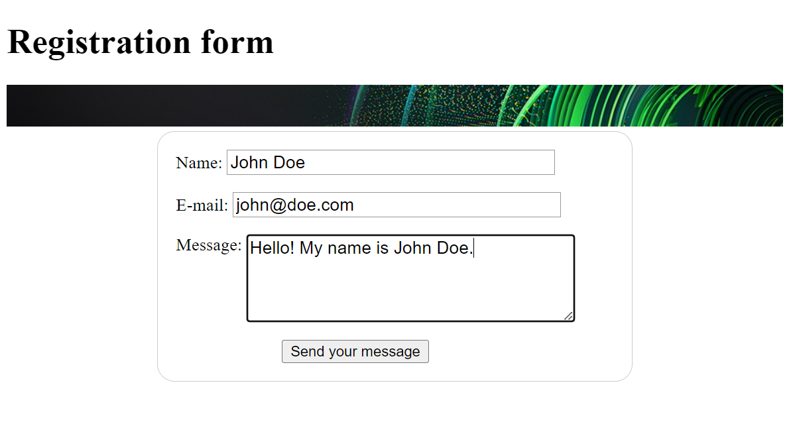
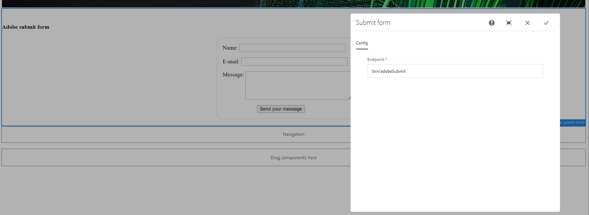
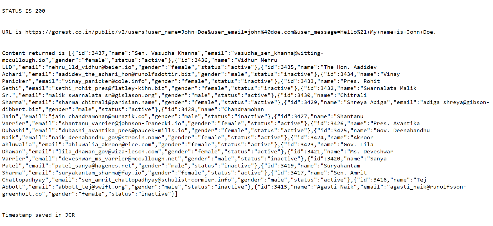
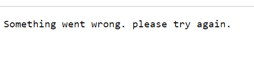
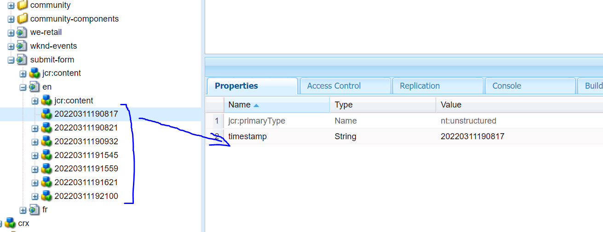

# Coding challenge - Submit form

## About

Create an AEM application that accepts user input through a web form and submits the collected data to a thirst party API using an AEM service while log the time of the request in JCR.

## Prerequisites

* Java 1.8 or greater
* Maven 3.5 or greater
* AEM 6.4.0 or greater 
* Git
  
##Tools and frameworks used

* Platform - AEM 6.5.0 (Java 1.8.0)
* Build tool - Maven 3.6.3
* IDE - IntelliJ Ultimate 2021.1
* Version control - Git 2.31.1
* Testing - Junit 5.8.1
* External dependencies
  * Dummy REST API - https://gorest.co.in/public/v2/users
  * Snipping tool - for screenshots
  * Github account
  

## How to build and run

* Start your AEM authoring instance on port 4502 and run the following command to build and install the package: 
  
  >  mvn clean install -PautoInstallPackage
  
* Visit the following page, fill in the form and click on 'Send your message' button

  > http://localhost:4502/content/submit-form/en.html?wcmmode=disabled

## Testing

* unit test in core: this show-cases classic unit testing of the code contained in the bundle. To test, execute:

  > mvn clean test
   
## Output

* Form component with the fields filled in
  
  

* Form component dialog

  

* Success screen
  
  

* Failure screen

  

* Request timestamp/metadata bring stored in crx/de
  
  

## Solution design summary

  * The first part of the solution is a form component ***adobeSubmitForm*** which contains three text input fields and a button. This form component also contains a dialog that an author can use to input the enpoint where the data collected by the form should be submitted when *Send your message* button is clicked.
  * The form submits a *GET* request to ***AdobeSubmitFormServlet*** that accepts the parameters submitted by the form and packages and submits this data to a third party API. It then reads the response received from the API-
    * If the response is 200, it prints the success data onto the page and also calls ***saveTimestampInJRC()*** method that saves the timestamp of the request in JCR.
    * In case of a failure, a failure message is printed onto the page
  
## Next steps and future enhancements

  * A UI can be designed and developed to improve customer experience
  * The ***adobeSubmitForm*** component can be split into individual components namely - A form container, text input and Button to make the solution more modular and the code reusable. It has been implemented as a single component in this solution for simplicity.
  * Validations can be added to form fields
  * The button can be tied to JS code to have a higher control on request creation and handle success and failure scenarios more efficiently. 
  * Submit request type can be changed to POST to enhance security. 
  * Efficient logging can be implemented to make debugging easy 
  * More unit tests with a higher code coverage to detect issues early.
